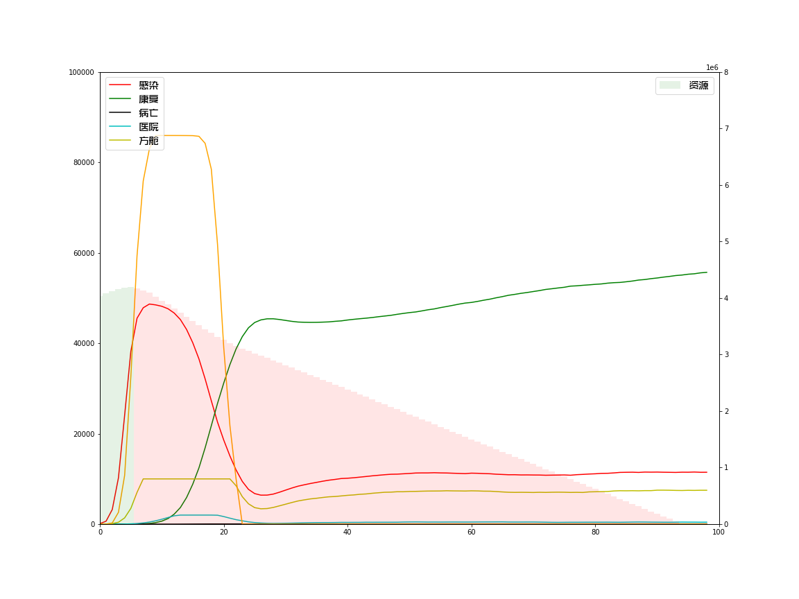

## 人群中病毒传播及防控模拟 2

需安装库：**numpy、matplotlib、ipython**

强烈建议使用 jupyter notebook 运行 ipynb 代码文件

为方便大家理解和修改代码，故将变量和函数均以中文命名

效果演示：

相关文章：

[病毒传播模拟实验2-清零还是共存？](https://mp.weixin.qq.com/s/NosNwunw3n1kc2oPDl3WRw)

[【实验模拟】对疫情，我们可以放松警惕了吗？](https://mp.weixin.qq.com/s/-6whGvu4K2I5oVwfKwYiWw)

B站视频：

[病毒传播模拟实验-清零还是共存？](https://www.bilibili.com/video/BV1v34y1Y7x8/)

[【实验模拟】不要给病毒反弹的机会！](https://www.bilibili.com/video/av93691362/)

此代码中的疑问可在公众号 **Crossin的编程教室** （crossincode）里讨论

----

更多实用有趣的例程

欢迎关注“**Crossin的编程教室**”公众号及[同名BiliBili账号](https://space.bilibili.com/17095888)

