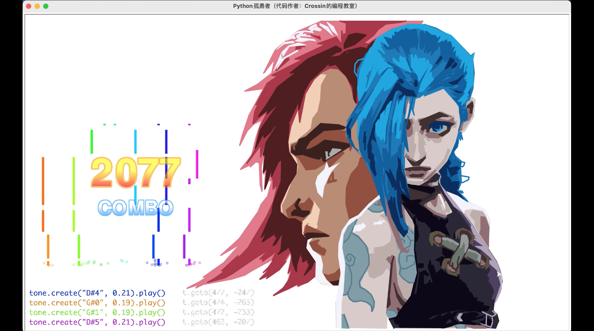

## Python版《孤勇者》

**相关视频：**

[Python版 孤勇者-哔哩哔哩-bilibili](https://www.bilibili.com/video/BV1yY41177bH/)

代码可下载、可修改、可商用，但需保留来源署名：**Crossin的编程教室**

**所用工具：**

Python3 

绘图：turtle 库（内置）

演奏+可视化：pgzero 库（需安装）

**代码说明：**

- draw.py - 绘图。Python环境无需安装库可直接运行
- play.py - 演奏音乐。需安装 pgzero 库
- draw_and_play.py - 绘图+演奏（不同电脑运行速率可能会有差异）
- visual_play.py - 演奏音乐 + 音符可视化 + 控制台输出

**可执行文件：**

链接: https://pan.baidu.com/s/1bs-kMahsyVfL70F5ELxZzg?pwd=jfif 提取码: jfif 

更多实用有趣的例程

欢迎关注“**Crossin的编程教室**”公众号及同名 [B站](https://space.bilibili.com/17095888)

