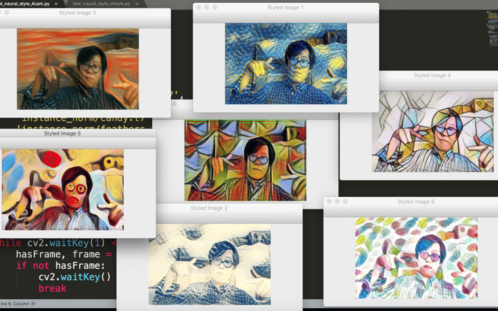

## Python+OpenCV 图像风格迁移

需要安装库：opencv （3.3 以上版本）

由于模型文件太大，仅提供1个模型下载，其余下载地址在 download_style_transfer_models.sh 文件中给出，执行命令可自动下载：

`sh download_style_transfer_models.sh`

参考阅读：[Python+OpenCV 十几行代码模仿世界名画](https://mp.weixin.qq.com/s/DITIb4a-yZxH2XtpmXhxZg)

效果演示：

参考项目：

https://github.com/jcjohnson/fast-neural-style

https://github.com/opencv/opencv/blob/3.4.0/samples/dnn/fast_neural_style.py

更多实用有趣的例程

欢迎关注“**Crossin的编程教室**”及同名 [知乎专栏](https://zhuanlan.zhihu.com/crossin)

