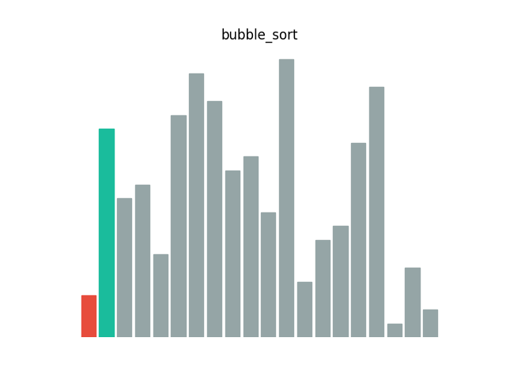
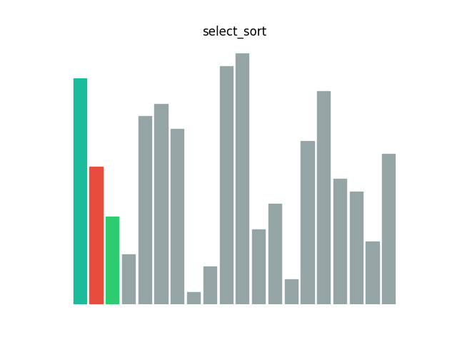
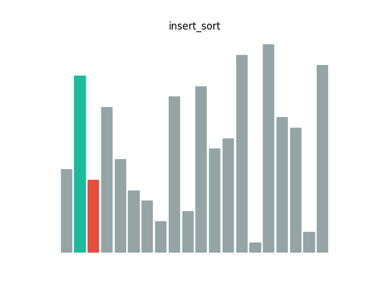
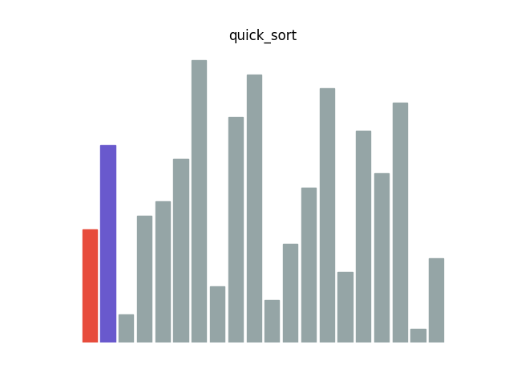
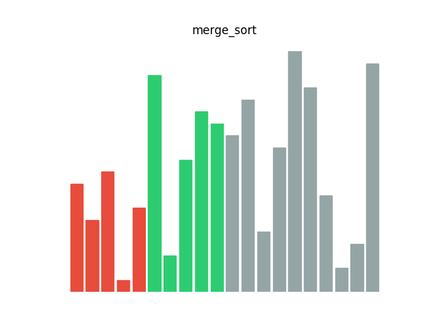

# algo.vi 基本排序算法动态可视化

原项目地址：https://github.com/Provinm/algo.vi

------

依托 [matplotlib](https://matplotlib.org/) 实现的基本排序算法的动态可视化，并通过 [pyaudio](https://github.com/jleb/pyaudio) 增加音效。

### 安装

在使用之前请先检查本地是否存在以下库：

- matplotlib
- pyaudio
- fire

requirements.txt 中包含了上述的库


### 使用

目前本项目仅提供了以下排序算法

- 冒泡排序



- 选择排序



- 插入排序



- 快排



- 归并排序



#### 命令行工具

命令行工具依托与简单好用的 [fire](https://github.com/google/python-fire)

使用方法

进入 algo_vi 文件夹后在命令行

简单使用方法：

```  
$ python start.py sortex quick_sort
```

排序对应关系

- 冒泡排序(bubble_sort)
- 选择排序(select_sort)
- 插入排序(insert_sort)
- 快排(quick_sort)
- 归并排序(merge_sort)

自定义参数

１、排序数据

排序的原始数据可不提供，此时程序将　1-20 这个 20 个数打乱提供给程序使用，如需要自定义，按照以下形式提供

```
$ python start.py sortex quick_sort [1,3,5,4,2,6]

```

2、其他参数

本系列参数与 matplotlib 设置相关

2.1 间隔时间

设置动画刷新时间,单位为 ms

```
$ python start.py sortex quick_sort --interval=50

```

2.2 图例标题

设置画面显示标题，目前　title 的内容仅支持英文和数字，中文会显示乱码。

```
$ python start.py sortex quick_sort --title='quick'

```


#### 使用提供的 api 

除了提供命令行工具之外，本项目也提供了 api 支持

进入 algo_vi 文件夹中的 api.py，查看相关用法。

#### 排序算法

具体排序算法的代码实现见 **sortx.py**

几乎所有的数据结构与算法相关书籍都对排序方法有详细介绍，这里不再赘述。

如有兴趣请关注微信公众号“Crossin的编程教室”，我们之后将提供更多这方面的内容。