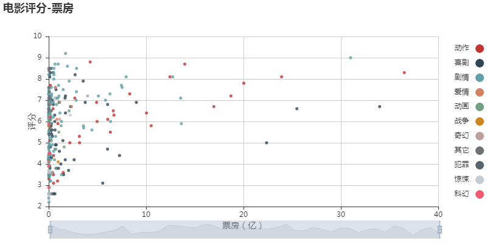
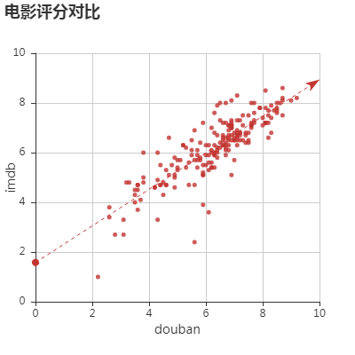
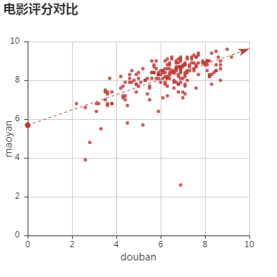
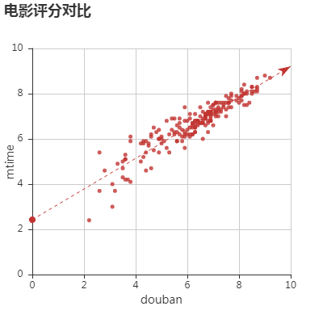
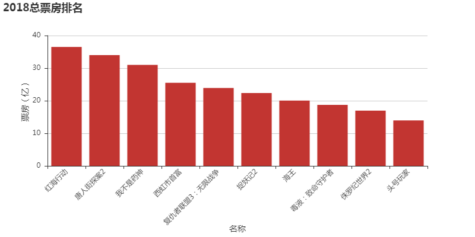
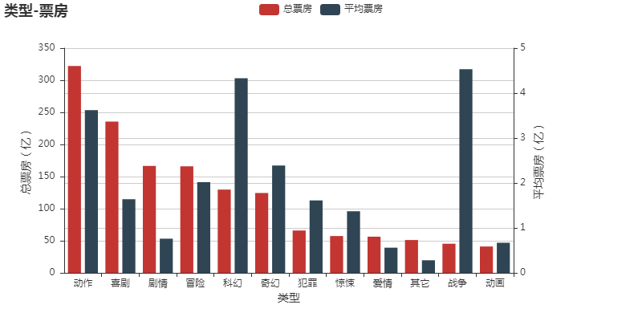
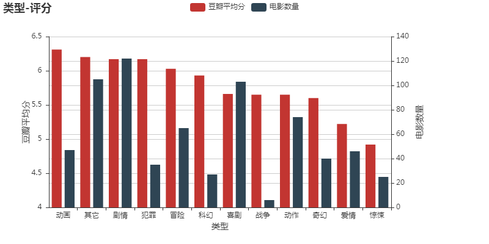
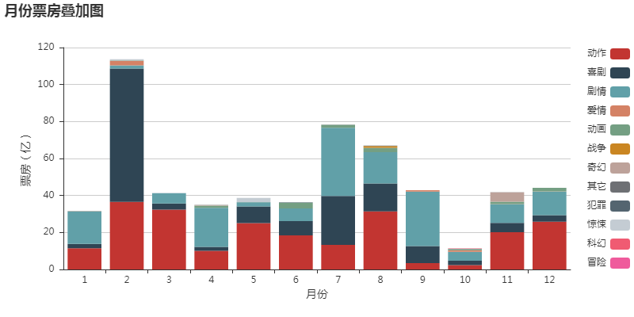
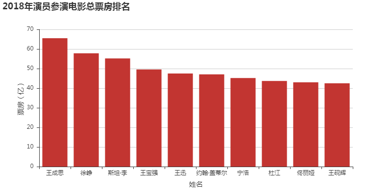

## 2018年国内上映电影票房评分分析

参考文章：[我敢打赌，你猜不到去年电影国内票房最高的演员是谁](https://mp.weixin.qq.com/s/RXzmheEBtq_Mb8i_c5EwPg)

#### 项目内容

统计2018年在国内上映的所有电影，分别获取上映电影的票房、评分（豆瓣、猫眼、时光、imdb）、类型、上映日期、演员、导演等数据。利用所获数据绘图，对2018年国内上映电影进行定量分析

#### 项目思路
1. 通过 [中国票房网](http://www.cbooo.cn/) 获得2018年大陆上映电影和每部电影票房数据
2. 根据已有的票房数据，通过[豆瓣](https://movie.douban.com/)  api 和详细页面，获得每部电影的导演，演员和豆瓣评分等详细数据
3. 分别通过 [猫眼](https://maoyan.com/)、[时光网](http://www.mtime.com/) 和 [imdb](https://www.imdb.com/)，获取这三个网站的电影评分数据
4. 新建影人条目，利用豆瓣获得的影人数据，对2018年每个演员年参演电影进行统计
4. 根据已有数据作图，分析2018年电影票房排名、不同网站评分差异、电影票房-评分关系等

#### 运行环境
- Python 3.6
- linux/windows
- jupyter notebook

#### 运行依赖包
- requests
- bs4
- pymongo
- numpy
- pyecharts

#### 文件说明
+ movies_data 文件夹: 包括了所有获取数据所需的 .py 文件
  - step0_chinamovies.py：获取中国票房网2018年所有国内上映电影及票房
  - step1_doubanmovies.py：根据中国票房网得到的电影数据，从豆瓣 api 接口中获得更详细的数据并存入数据库
  - step1_doubanmovies_supplement.py：用来寻找在 step1_doubanmovies.py 中由于名称原因没有找到的电影
  - step2_moviedetail.py：获得每部电影在不同网站的评分、演职人员等详细信息
  - step3_celebrity.py：计算每个影人（导演）2018年参（导）演电影的票房总和

+ movie_draws 文件夹
  - movie_pyecharts.ipynb
    - 为了更加直观的进行展示，数据分析和绘图的代码写在了 jupyter notebook 里面
    - 采用 pyecharts 绘图，包括“电影评分-票房”等八张图
  - 包括了HTML格式的所有 movie_pyecharts.ipynb 绘制图

+ output_data 文件夹
  - data_output.py: 从数据库导出电影和影人数据的 .py 文件
  - movie_data.csv: 抓取的2018年所有电影条目，共 522 部
  - cast_data.csv: 每个影人2018年参演电影及电影票房总和排名，共 4723 影人

#### 一些技术细节
+ 由于要更改数据库，所有获取数据并保存数据库的操作都写成了函数形式，执行函数的代码加了注释，可根据自身需要去掉注释运行代码
+ 数据保存：数据采用mongodb保存，使用时需要安装 pymongo 第三方库
  - 连接到数据表
    ```
    client = pymongo.MongoClient()
    db = client.chinamovies # 连接到数据库
    collections = db.movies # 数据表 movies
    collections_detail = db.moviesdetail # 豆瓣数据都放入了数据表 moviesdetail 中
    ```
  - 写入多条数据 
    `collections.insert_many(data['pData'])`
  - 写入一条数据 
    `collections_detail.insert_one(datadetail)`
  - 更新数据
    ```
    # 更新数据到数据库中
    collections_detail.update({'_id': i['_id']}, {'$set': {'猫眼':{
        'title': movie['nm'], 'rank': movie['sc'],
        'id': movie['id'], 'pubDesc': movie['pubDesc']
    }}})
    ```
+ 数据验证
  - 本项目中，由于涉及多个网站的电影数据，因此会发生 网站A 电影上映日期或名称与 网站B 不同的情况。本项目中，电影上映日期和名称均以豆瓣网为准。利用 网站A 的电影名在 网站B 中进行搜索时，必须要保证电影名和上映年份完全一致，对于电影名不符合的电影，需要进行二次的人工判断
  - 例：
      ```
      # 必须要名称一致且2018年大陆上映才符合要求
      if movie['nm'] == i['title'] and re.findall(r'2018.*大陆上映', movie['pubDesc']):
          ... # 符合要求
      ```
+ 绘图：利用 pyecharts 绘图，pyecharts 使用可见官方文档：<http://pyecharts.org/>

#### 所有图表
1. 
2. 
3. 
4. 
5. 
6. 
7. 
8. 
9. 

更多实用有趣的例程

欢迎关注“**Crossin的编程教室**”及同名 [知乎专栏](https://zhuanlan.zhihu.com/crossin)

