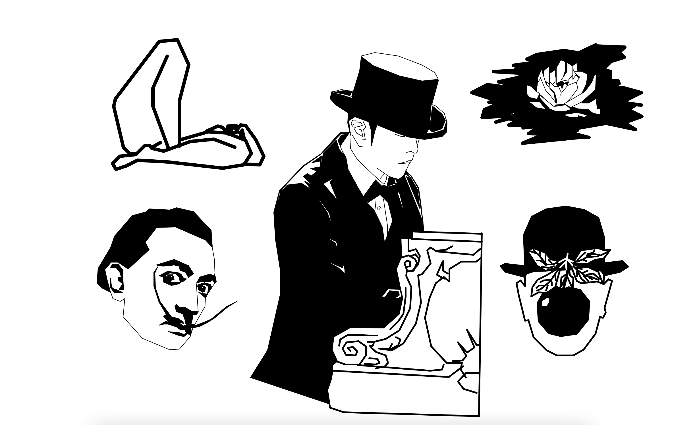

## Python画《最伟大的作品》

代码可下载、可修改、可商用，但需保留来源署名：**Crossin的编程教室**

所用工具：Python3 及自带 turtle 库

更多实用有趣的例程

欢迎关注“**Crossin的编程教室**”公众号及同名 [哔哩哔哩](https://space.bilibili.com/17095888) | [知乎](https://www.zhihu.com/people/crossin)

