# 漫威角色关系图
## 项目内容  
调用 marvel API 获取 marvel 英雄 id，及与英雄相关的故事数，并储存在 mongodb 数据库中；生成 gephi 所需文件（这里以 csv 文件为例）；使用 gephi 生成英雄关系图谱。

参考文章：[谁才是漫威的绝对C位](https://mp.weixin.qq.com/s/TjmtGh89nMrRBirf6XRFCw)

更多实用有趣的例程，欢迎关注“**Crossin的编程教室**”及同名 [知乎专栏](https://zhuanlan.zhihu.com/crossin)

## 项目思路
1. 使用第三方库 marvel，获取 marvel 所有英雄，并根据与英雄相关故事数排序。 
    1.1 marvel 库<https://pypi.org/project/marvel/> 将官方 API <https://developer.marvel.com/docs>进行了封装，更方便使用，当然密钥还是要自己去官网申请的； 
    1.2 选择一定数量的相关故事数多的 marvel 英雄(一共1491位英雄)进行分析。

2. 熟悉 gephi 的常用操作，如基本界面、布局及统计的使用。 
    2.1 查看官方新手文档<https://gephi.org/users/quick-start/>，了解基本操作，及相应设置。

3. 本次分析主要在于查找 marvel 英雄故事数最多的前n位英雄的人物关系，所以数据抓取时，要根据自己的目的进行抓取，这是最重要的。 
    3.1 再次强调先思考自己需要的数据，当然只是想尝试一下，探索未知的秘密也是极棒的。

## 运行环境
* python 3.7.2
* mongodb
* Gephi
## python库
* marvel
* requests
* pymongo
* csv
* codecs
* time
## 文件说明
* marvel_gephi.py: 代码文件; 代码解释见代码内注释。
* pic文件夹为一些图片，包括最后的效果图。
* in_data 为输入的 node（节点）与 edge（边）文件，out_data 是我操作完 gephi 后导出的文件。
* **相关参数解释：** 
   * 节点（node）也就是顶点（vertice）。两个节点相连的部分称为边（edge）。
   * inode文件中：id 为英雄角色id ，即图中的节点，name 为英雄角色名字，id 与 name 一一对应；weight 为每一个英雄相关的所有故事数量，即节点的大小（权重）。
   * iedge 文件中：source 与 target 为源 id 与目标 id，表示两个角色之间的联系，即图中的边，本测试中因选择无向边，所以 source 与 target 不表示方向边表示边（无向）；weight 为同一故事中出现这两个英雄的故事数量，即图中边的大小（权重）。
## 抓取步骤
### 建议抓取前先抓取页面进行分析，再决定抓取策略),对于后面要使用的 gephi 来说我们需要：一个节点文件与一个边文件
1. 获取 marvel 英雄所有角色（共1491个）：store.charac(); 生成节点文件：node() 
   1.1 官网(<https://developer.marvel.com/>)注册后，获取 **PUBLIC_KEY** 和 **PRIVATE_KEY** ，同时告知限制抓取速率3000/day；抓取前可在官网测试 **API 接口**(<https://developer.marvel.com/docs>)测试，了解请求参数，及返回数据的内容。 
   1.2 store.charac() 由我这边抓取实际情况，每次最多请求100个角色信息，则15次就可抓取完成，抓取异常出现情况较少，所以出现问题就对错误处，重新抓取，直到成功。抓取成功后直接存入 mongodb 中，由于该文档抓取数据量很大，除所需的**故事相关的数据**外，还包括漫画，系列的相关信息（同时也可以绘制英雄角色与其他参数的相关性图）。便不展示mongodb 中的全部数据，具体返回内容可在官网测试 API 接口(<https://developer.marvel.com/docs>)查看。 
   1.3 node() 从数据库中取出英雄及对应的故事数后，由故事数最多的前**99名英雄**的 id，name，相关联故事数；组成初步的**节点文件**。

2. 抓取与英雄相关的所有故事：store_stories(); 更新节点文件：update_character()；生成边文件：edge()
   2.1 由节点文件（见 inode.csv）可知，将99名角色相关的故事数总共有约70000多条，每次可抓100条,大概抓取700多次。此时抓取时要注意：
     a store_stories() 可能因为网络等问题不能一次抓取成功，这时就需要输出错误信息；首先将每一位角色信息争取抓完，抓取不完就将 角色 id 与当前抓取次数 保存在本地文件中，然后再根据 log 文件手动抓取，存入数据库。 
     b update_character() 由store_stories()抓取的故事文件可发现**实际抓取故事数**与前文store_charac()抓取数目不一样,以实际抓取为准，**更新节点文件**相关的故事数。 
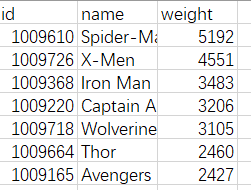 
     c edge() 最后就是**边文件**的获得，内容是两两角色 id 及相关联的故事数。 
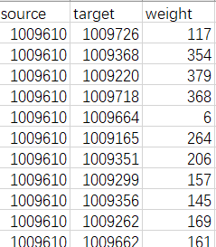

* 先来一张 gephi 生成的图片，故事数大于等于543的36个角色数据；后面更精彩： 
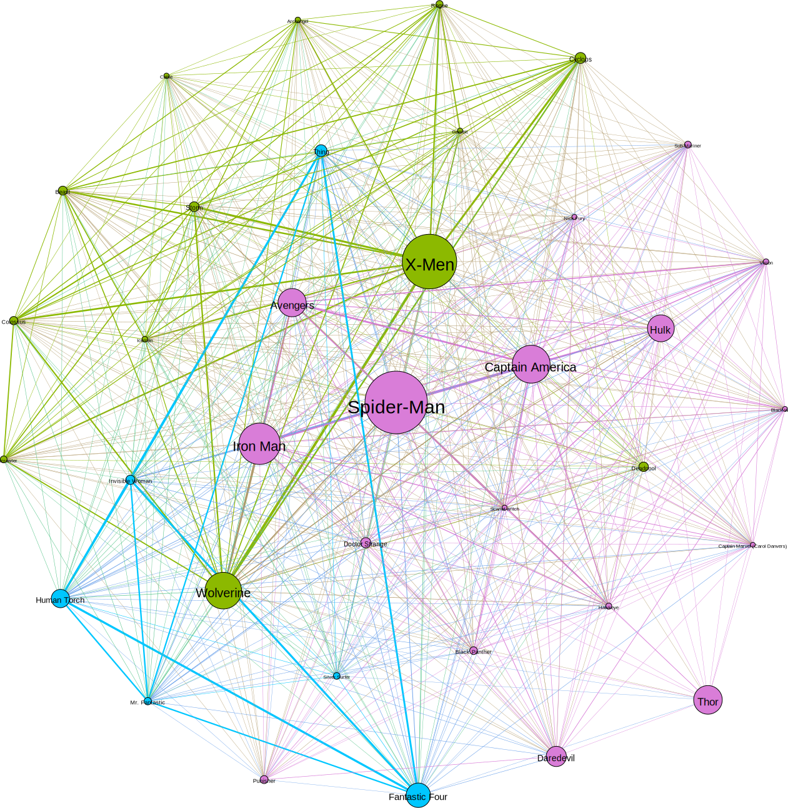
## gephi使用
* 查看官方新手文档(<https://gephi.org/users/quick-start/>)。
* 本次使用输入 gephi 文档：inode.csv, iedge.csv;
* 步骤：
  1.  从【文件】-->【打开文件】中导入节点文件与边文件，注意导入边表格时，选择添加到【已存在的工作空间】（Append to existing workspace） 。 
  2.  选择【布局】-->【选择一个布局】-->【Fruchterman Reingold】 ，进行相关算法运算。 
  3.  选择【统计】-->【运行模块化】，计算 modularity_class 数据 
  4. 外观 
     4.1 选择【外观】-->【节点】+【颜色】-->【Partition】-->【Modularity Class】：利用刚刚的模块化数据进行分类。 
     4.2 选择【外观】-->【节点】+【大小】-->【Ranking】-->【Weight】: 使用传入的 weight（故事数）决定节点大小。 
     4.3 选择【数据资料】-->【数据表格】-->【复制数据到其它列】：将 name 列复制到 Label 列。 
     4.4 选择【图】-->【T】即可显示标签。 
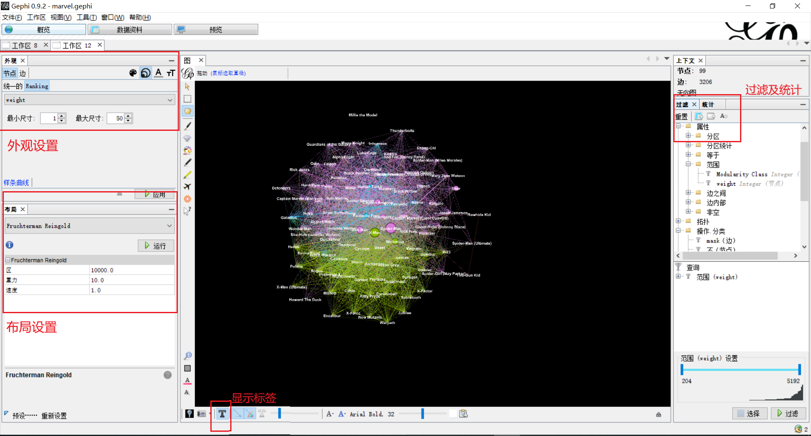
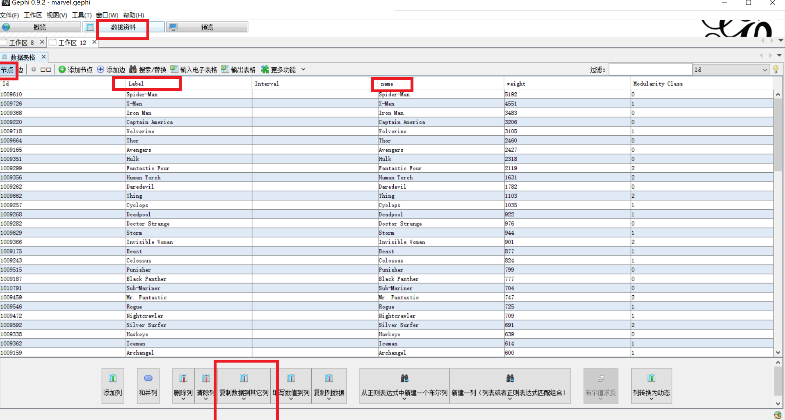 
     4.5 在【预览】处自己调整好需要的数据后，点击【SVG/PDF/PNG】，即可导出图形。
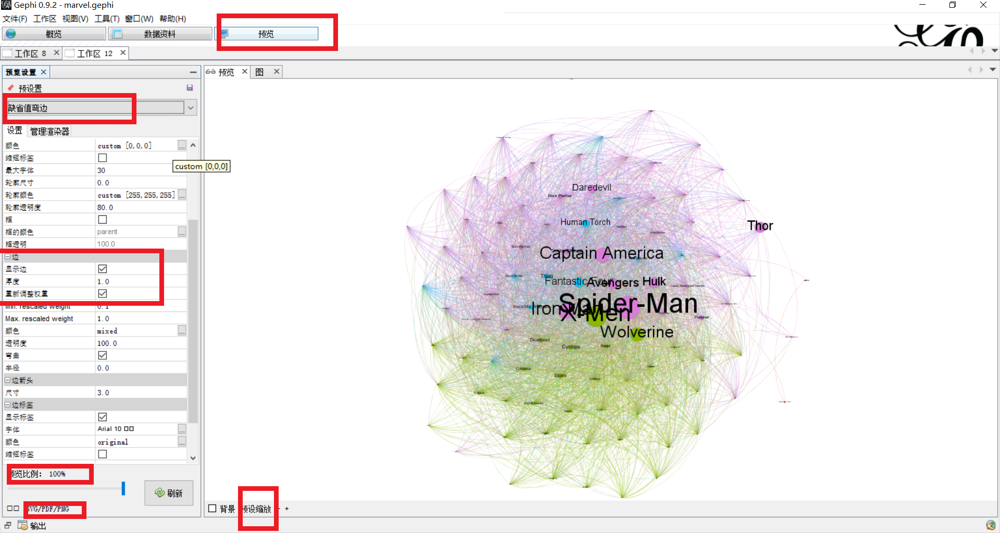 
     4.6 还有更多的【过滤】，【统计】，【预览】的相关功能，就由大家慢慢探索了。
* 图片参考及部分 gephi 设置。
   * 节点数据：

  

   * 边数据：

  

   * 外观设置当在【统计】处 点击【运行模块化后】，此处出现【Modularity Class】：

  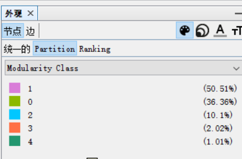

   * 【layout】（布局）设置，布局算法选择：【Fruchterman Reingold】：

  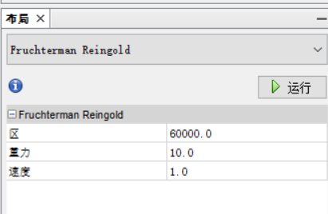

   * 【统计】部分-点击【运行模块化】：

  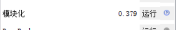
## 一些小提议
* 记得去官网申请一下密钥，地址在这：(<https://developer.marvel.com>)。
* marvel 返回 json 格式文件，所以选择 mongodb 方便数据存储。
* 注意官网说的速率是一天3000次，基本上也是足够了，但是注意 marvel 官网好像是美国时间，具体的时间不清楚，我们可能和这个接口的更新时间需要倒时差。
* 若按照本文的代码抓取，则 mongodb 中还有漫画，系列等相关数据，有兴趣去的小伙伴也可以绘制出其他数据的图。
* 最后，有问题敬请指出；大家玩的愉快。
* 效果图： 
故事数大于等于709的25个角色数据：
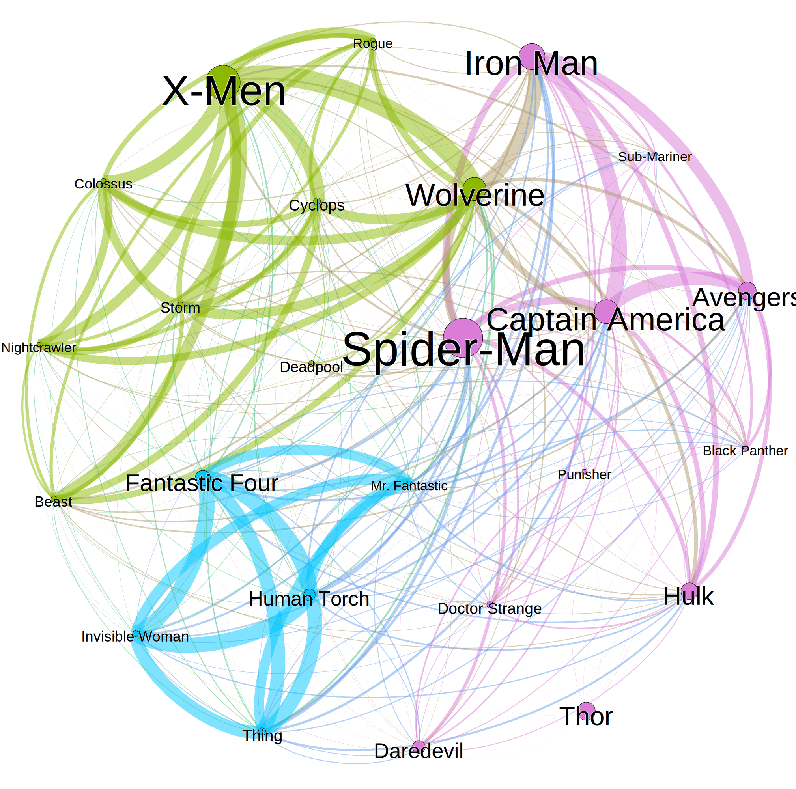
故事数大于等于543的36个角色数据：

故事数大于等于204的99个角色数据:
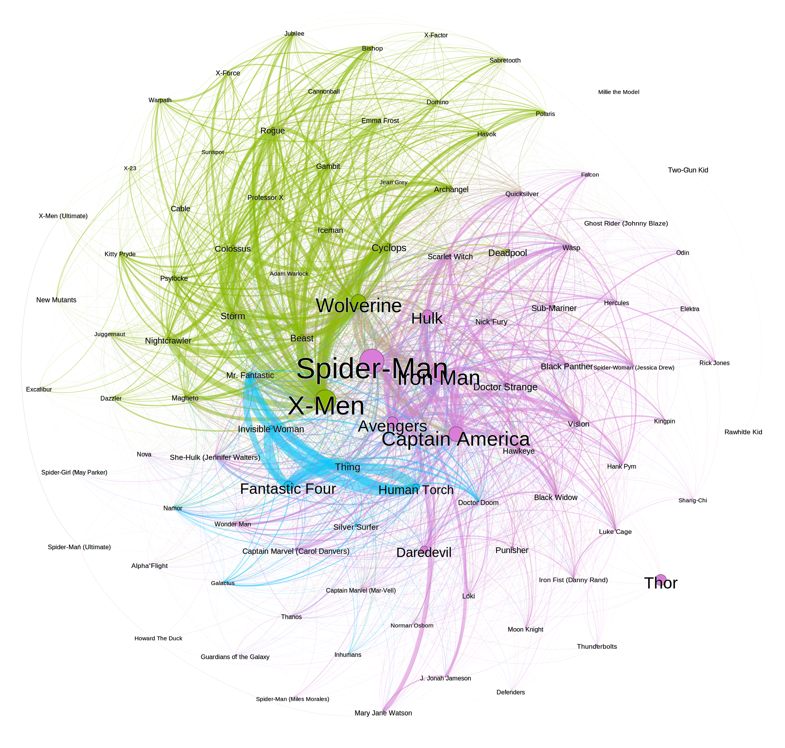
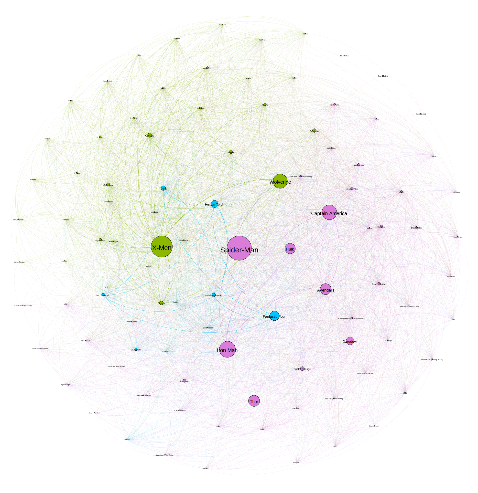

