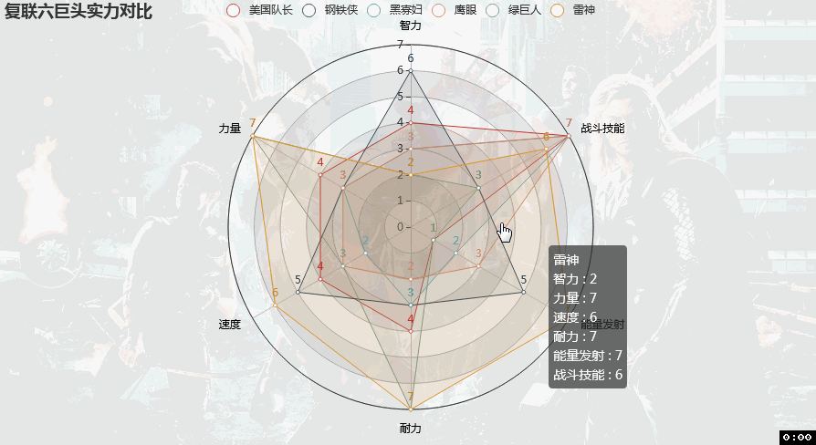

# radar chart of marvel avengers

#### 介绍
用雷达图描绘漫威英雄战斗力

#### 效果

用雷达图描绘漫威英雄战斗力

参考阅读：[pyecharts绘制复联超级英雄战斗力](https://mp.weixin.qq.com/s/QfzYrbOpks9qmZizlcoYew)

如有任何问题，请联系微信tyrant100

原项目地址：

[https://gitee.com/leonmovie/radar-chart-of-marvel-avengers](https://gitee.com/leonmovie/radar-chart-of-marvel-avengers)

----

更多实用有趣的例程

欢迎关注“**Crossin的编程教室**”及同名 [知乎专栏](https://zhuanlan.zhihu.com/crossin)

