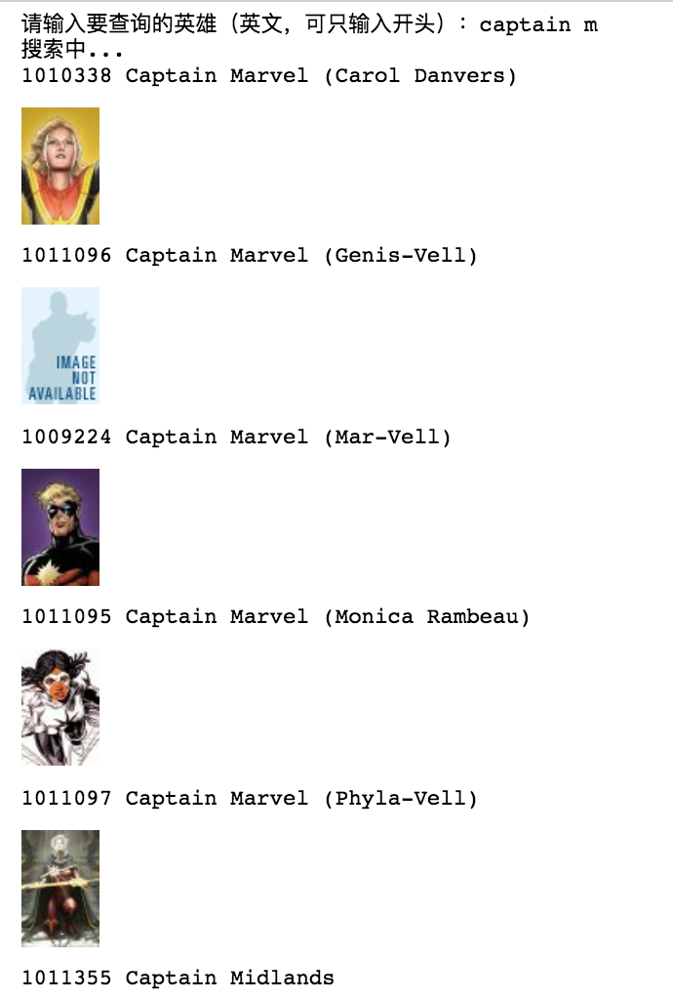

## Marvel API 示例

需要安装库：

* marvel
* IPython

建议使用 Jupyter 运行，否则图片无法自动显示

参考文章：

[这可能是我用过最“强大”的API](https://mp.weixin.qq.com/s/ILSbvRJ0hQqpXvBNPJR_Xg)

数据可视化：

更多实用有趣的例程

欢迎关注“**Crossin的编程教室**”及同名 [知乎专栏](https://zhuanlan.zhihu.com/crossin)

