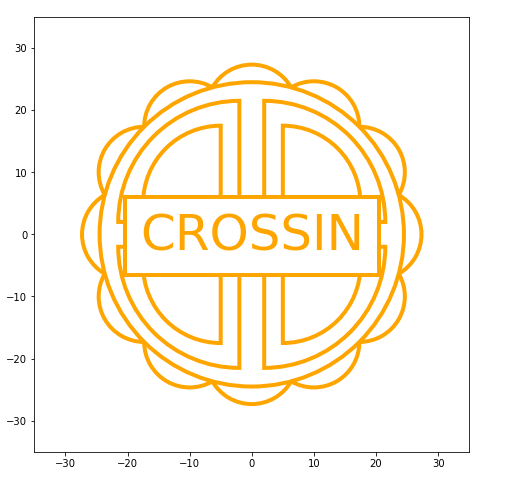

# 用Python画一个Crossin牌“月饼”

#### 介绍
利用matplotlib里的绘制曲线功能，画一个月饼图案

#### 依赖库

matplotlib、numpy

#### 效果

如有任何问题，欢迎联系本例作者，微信tyrant100

----

更多实用有趣的例程

欢迎关注“**Crossin的编程教室**”及同名 [知乎专栏](https://zhuanlan.zhihu.com/crossin)

