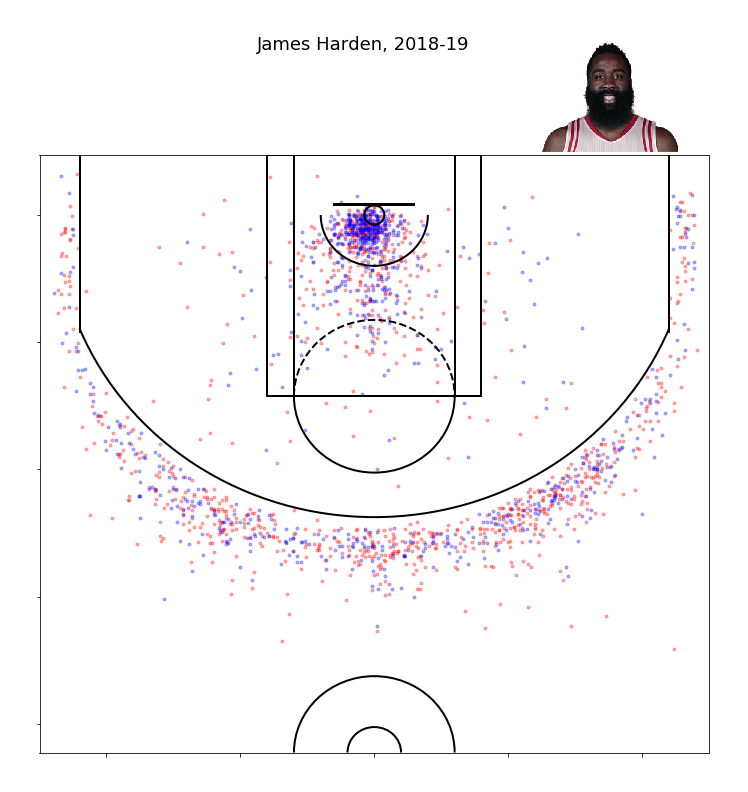
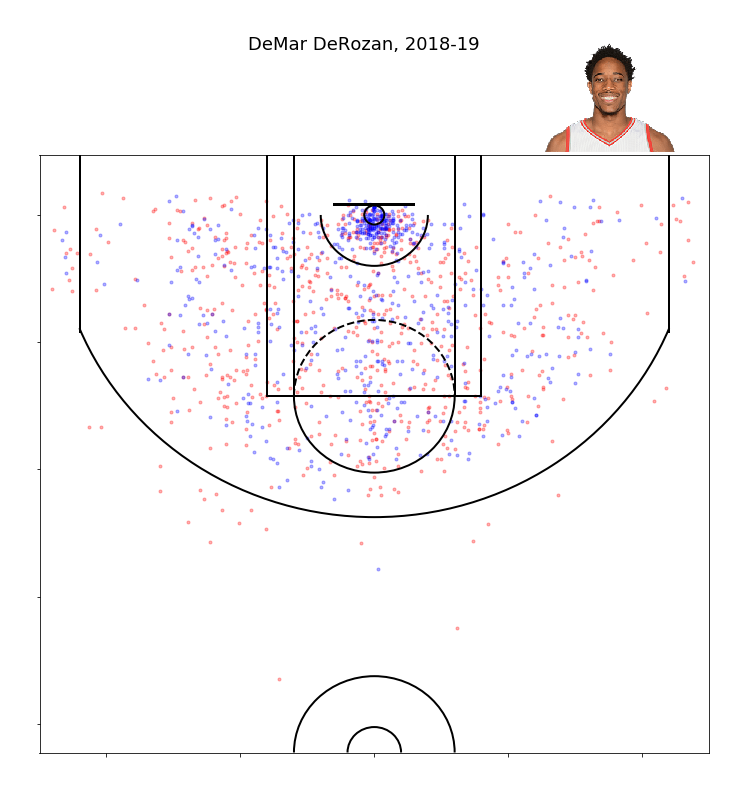
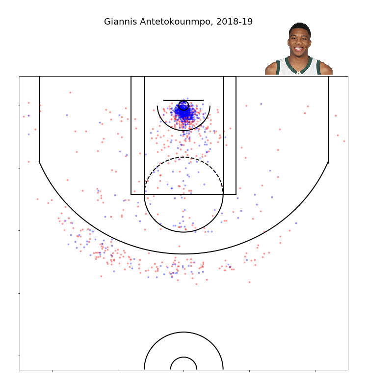
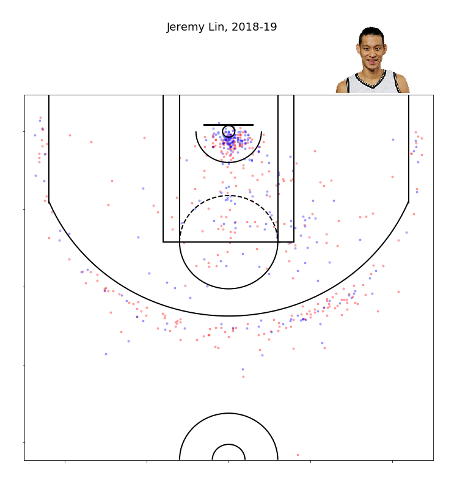

## NBA球员出手点绘制

#### 运行环境
- Python 3.6

#### 运行依赖包
- requests
- matplotlib
- pandas

#### 代码说明
1. 用户ID需手动输入，可从 https://stats.nba.com/players/ 这里查找
2. 蓝色点为命中，红色点为未命中
3. 建议通过 Jupyter 运行，效果会比较好。py文件运行有可能在某些系统出现错位

#### 参考文章

[NBA的球星们喜欢在哪个位置出手](https://mp.weixin.qq.com/s/pumsu5IVpb3P5BSycBC1mA)

#### 演示效果

要是喜欢就关注下我的公众号呗，“**Crossin的编程教室**”，或者同名 [知乎专栏](https://zhuanlan.zhihu.com/crossin)

里面还有很多有意思的程序，感谢各位！

