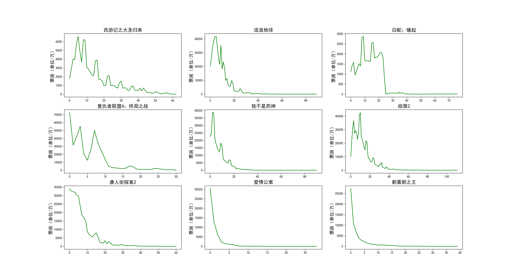
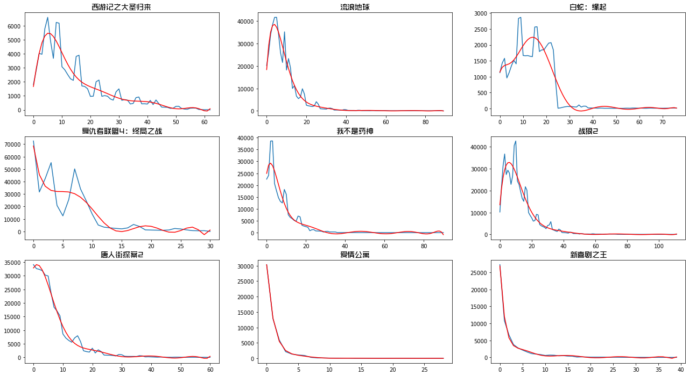
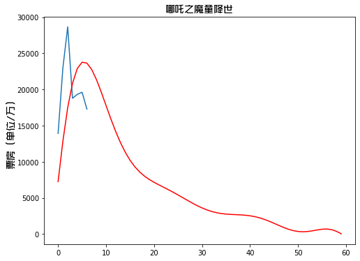
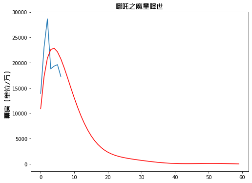
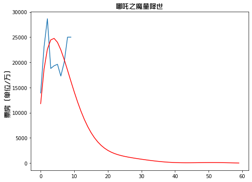

## 《哪吒》票房预测

#### 运行环境
- Python 3.7

#### 运行依赖包
- requests
- matplotlib
- pandas
- numpy
- scipy

#### 代码说明
1. get_boxoffice.py 从猫眼票房获取几部参考影片的历史票房数据，结果保存在 boxoffice.csv
2. get_nezha.py 从猫眼票房获取《哪吒》票房数据，结果保存在 nezha.csv
3. plot.py 绘制历史票房走势图
4. nezha.py 对历史票房进行曲线拟合，并对《哪吒》票房进行预测

#### 参考文章

[用python“科学”预测下《哪吒》票房](https://mp.weixin.qq.com/s/NsY4N-eH9EjuRzIjoaa-2Q)

#### 演示效果

要是喜欢就关注下我的公众号呗，“**Crossin的编程教室**”，或者同名 [知乎专栏](https://zhuanlan.zhihu.com/crossin)

里面还有很多有意思的程序，感谢各位！

