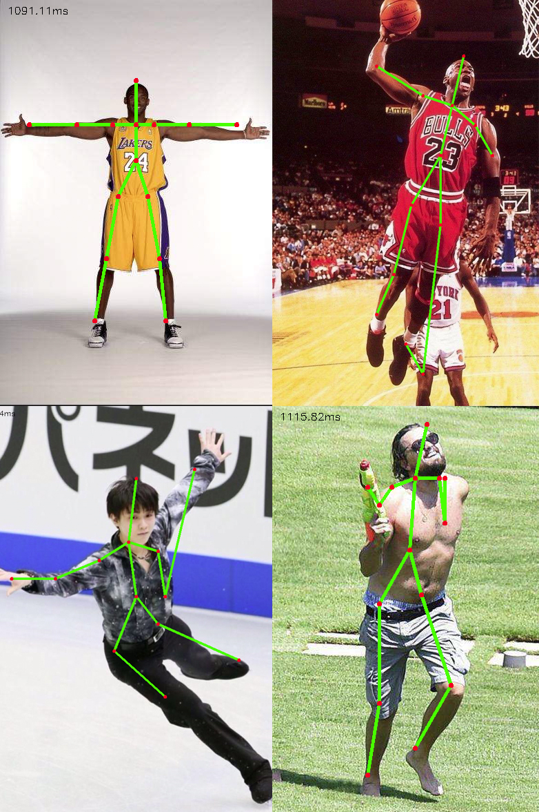
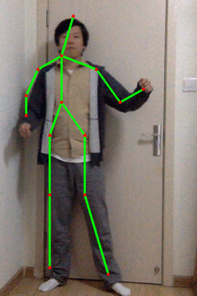

## Python+OpenCV+Openopse 人体姿态估计

需要安装库：opencv （3.3 以上版本）

模型下载地址在 getModels.sh 文件中给出，执行命令可自动下载：

`sh getModels.sh`

windows 运行 `getModels.bat`

参考文章：[用 Python 实现抖音尬舞机](https://mp.weixin.qq.com/s/_CrlqYB1dLbQinu3dyRNcA)

效果演示：

参考项目：

https://github.com/CMU-Perceptual-Computing-Lab/openpose

https://github.com/opencv/opencv/blob/master/samples/dnn/openpose.py

更多实用有趣的例程

欢迎关注“**Crossin的编程教室**”及同名 [知乎专栏](https://zhuanlan.zhihu.com/crossin)

