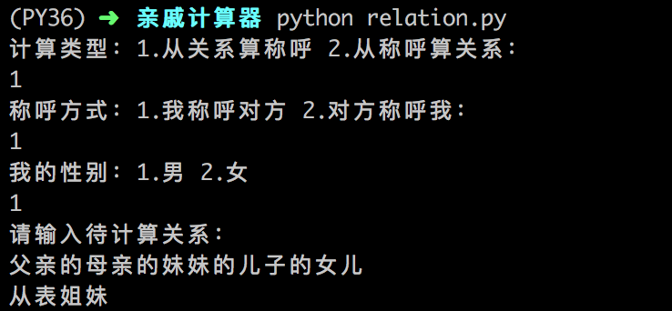

## 亲戚关系计算器

本项目为js版本亲戚关系计算器的python版实现

原项目地址：https://github.com/mumuy/relationship

参考阅读：[python版亲戚关系计算器](https://mp.weixin.qq.com/s/Nlow0BiOpwaa8OvBoqwnqw)

效果演示：

更多实用有趣的例程

欢迎关注“**Crossin的编程教室**”及同名 [知乎专栏](https://zhuanlan.zhihu.com/crossin)

