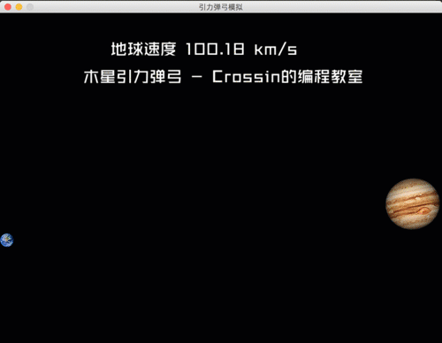

## 引力弹弓模拟

受《流浪地球》启发，使用python模拟地球飞越木星时产生的引力弹弓效应。

需安装库：**pygame**

参考阅读：[用python模拟地球飞越木星](https://mp.weixin.qq.com/s/ft66xCIOiON98Y70gX7XMA)

效果演示：

更多实用有趣的例程

欢迎关注“**Crossin的编程教室**”及同名 [知乎专栏](https://zhuanlan.zhihu.com/crossin)

