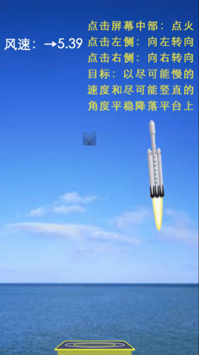

## 火箭回收小游戏

本案例基于 cocos2d-js 3.9 开发

运行游戏需将代码放在web服务器上。一种简单的办法是用 pycharm 导入代码文件夹，右键点击 index.html，选择使用浏览器打开。

相关文章：[火箭回收小游戏](https://mp.weixin.qq.com/s/vYxBeTISxgwfXOGeUKUS6Q)

------

更多实用有趣的例程

欢迎关注公众号“**Crossin的编程教室**”及同名 [知乎专栏](https://zhuanlan.zhihu.com/crossin)

