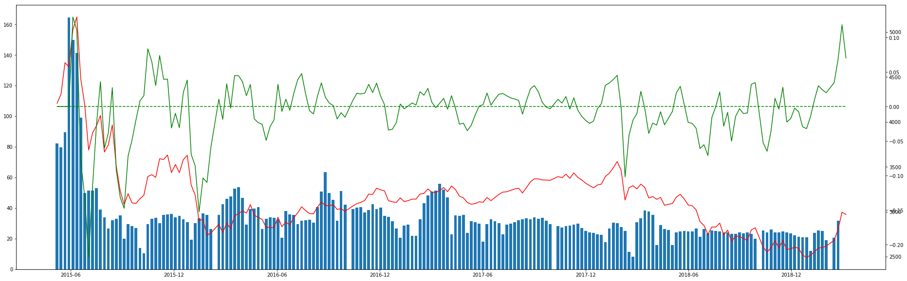

## 上证指数与开户数历史数据分析

需要安装库：

* tushare
* requests
* bs4
* pandas
* matplotlib

参考文章：

[看人炒股赚钱心痒痒？历史数据分析下，这波算什么水平](https://mp.weixin.qq.com/s/QrHtph_n-QrolfEcMoZuHw)

数据可视化：

更多实用有趣的例程

欢迎关注“**Crossin的编程教室**”及同名 [知乎专栏](https://zhuanlan.zhihu.com/crossin)

