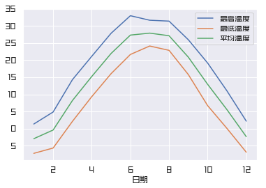
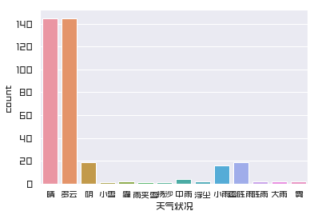
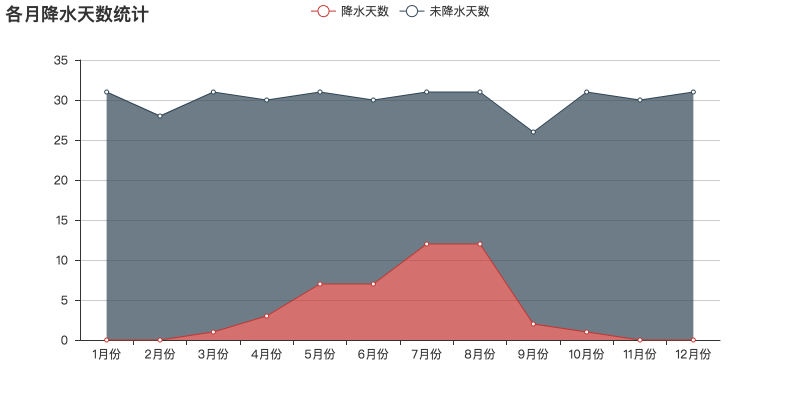

## 北京全年天气状况分析

需要安装库：

* requests
* bs4
* pandas
* matplotlib
* seaborn
* pyecharts

建议使用 Jupyter 运行，否则图片无法自动显示

参考文章：[北京全年天气状况分析](https://mp.weixin.qq.com/s/UbcGqbCLSqRagksT6a82hQ)

数据可视化：

更多实用有趣的例程

欢迎关注“**Crossin的编程教室**”及同名 [知乎专栏](https://zhuanlan.zhihu.com/crossin)

