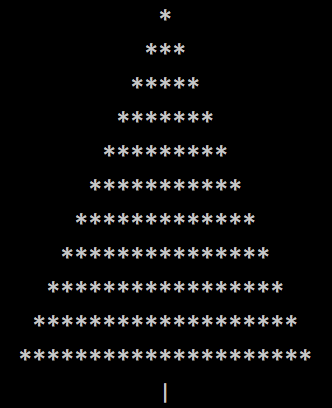
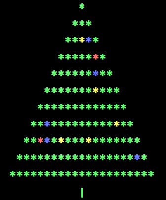
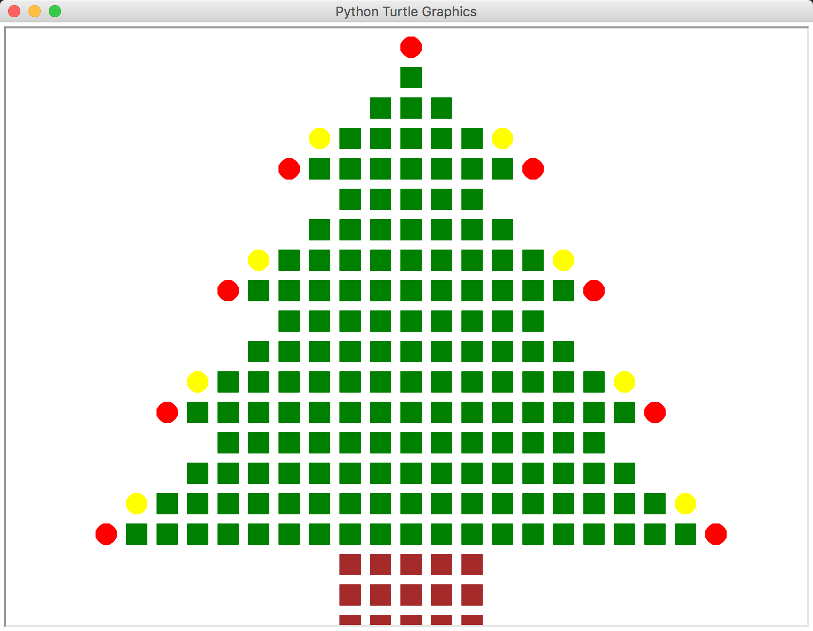
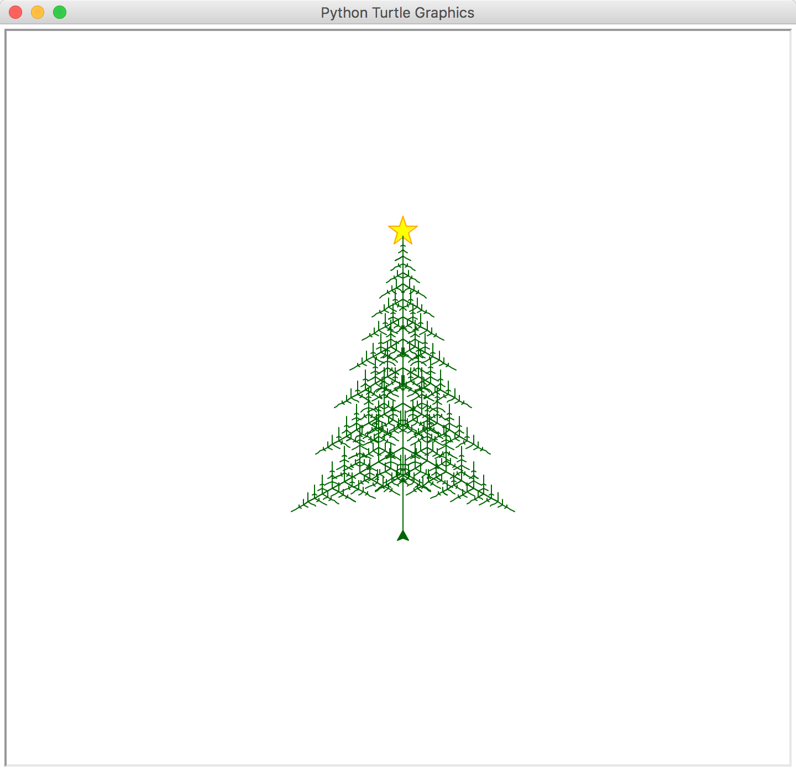

## 送你一棵圣诞树

参考文章：[送你一棵圣诞树](https://mp.weixin.qq.com/s/kXcPlO5sAqbM2g4G5hVqfg)

参考来源：

[R&Python绘制圣诞树-EasyCharts](https://ask.hellobi.com/blog/EasyCharts/5777)

[(圣诞礼物)在终端下画个圣诞树陪你过节-Medici.Yan](http://blog.evalbug.com/2015/12/25/py_fun_0/)

更多实用有趣的例程

欢迎关注“**Crossin的编程教室**”及同名 [知乎专栏](https://zhuanlan.zhihu.com/crossin)

